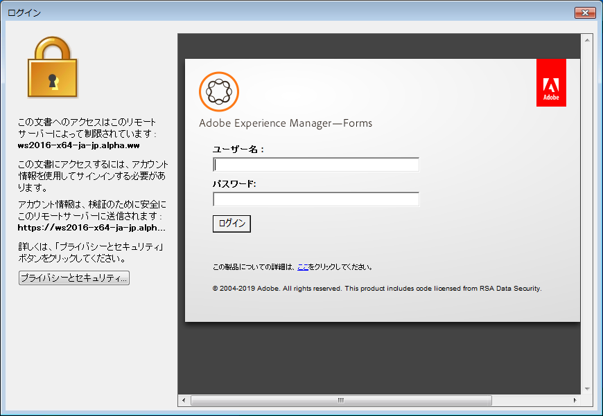

# AEM Document Security Extension for Microsoft Office を使用する{#using-aem-document-security-extension-for-microsoft-office}

## AEM Document Security Extension を使用してファイルを保護する {#usingaemdocumentsecurityextensiontoprotectfiles}

広範囲にファイルを配布する場合でも、ポリシーで保護されたファイルを受信者が使用する方法を制御できます。

Microsoft Office用ドキュメントセキュリティ拡張機能を使用して、次のタスクを実行できます。

* ドキュメントセキュリティへの接続の設定
* ファイルへのポリシーの適用
* ドキュメントセキュリティWebページを開き、ユーザーポリシーを作成および管理します
* ファイルからポリシー保護を削除する
* ファイルに適用するポリシーの変更
* ドキュメントセキュリティWebページを開いて、ファイルへのアクセスを取り消したり、ファイルのポリシーを変更したりします
* ドキュメントセキュリティWebページを開き、ファイルの監査履歴を表示します

### ドキュメントセキュリティサーバーに接続{#connect-to-a-document-security-server}

ファイルにポリシーを適用する場合は、ドキュメントセキュリティの接続設定を構成する必要があります。 Microsoft Office用ドキュメントセキュリティ拡張機能のインストール方法によっては、既に既定の接続設定が存在する場合があります。 ドキュメントセキュリティの1つ以上のインスタンスに対して接続設定を追加できます。 ドキュメントセキュリティ管理者からサーバー情報を取得できます。

ファイルの保護に使用するサーバーを設定するか、保護されたファイルを既定のサーバーとして管理する必要があります。 新しいファイルにポリシーを適用する場合、またはドキュメントセキュリティWebページを開く場合、ドキュメントセキュリティ拡張機能（Microsoft Office用）は既定のサーバーに接続します。 ドキュメントセキュリティの複数のインスタンスを使用してファイルを保護する場合は、サーバーを切り替える際に、デフォルトのサーバー設定を変更する必要があります。 ドキュメントセキュリティのインスタンスで保護されているファイルは、そのファイルを開く権限がある限り、開くことができます。

ドキュメントセキュリティサーバーで証明書ベースの認証を使用する場合は、ローカルマシンに受信した証明書をインストールする必要があります。 証明書認証を選択し、認証に使用する証明書を指定する必要があります。

1つのMicrosoft Officeアプリケーションでドキュメントセキュリティのインスタンスの接続設定を構成すると、その設定はすべてのWord、Excel、およびPowerPointに対して行われます。

#### クライアント側証明書{#install-the-client-side-certificate}のインストール

証明書認証または双方向認証を通じてドキュメントセキュリティWebページにアクセスする必要がある場合は、ローカルコンピューターにインストールする必要がある証明書を受け取ります。 証明書ファイル（.PFXまたは.P12ファイル）とそのパスワードを受け取ります。

1. ローカルマシンに証明書ファイルを保存します。
1. 証明書ファイルを重複クリックして証明書インポートウィザードを開き、「**次へ**」をクリックします。
1. 証明書ファイルが「ファイル名」ボックスに表示されている場合は、「**次へ**」をクリックします。 別の証明書を検索する場合は、「**参照**」をクリックします。
1. 受け取ったパスワードを入力し、「**次へ**」をクリックします。
1. 「Certificate Store」ダイアログで、「Place All Certificates In The Following Store」を選択し、「**Browse**」をクリックします。
1. 「Select Certificate Store」ダイアログで「Personal」を選択し、「**OK**」をクリックします。次に「**次へ**」をクリックし、「**完了**」をクリックします。

#### 接続設定を構成{#configure-connection-settings}

1. Document Security Extension for Microsoft 、Office 2010、および Office 2013 で、**「Document Security」**&#x200B;タブの&#x200B;**「サーバーを選択**」を選択します。
1. 「**新規**」をクリックして新しい接続設定を作成するか、既存の接続を選択して「**編集**」をクリックします。
1. 「**名前**」ボックスに接続名を入力します。 任意の名前を使用できます。
1. 「**Server Address**」ボックスにサーバーのアドレスを入力します。
1. 「**Port**」ボックスにサーバーポートを入力します。
1. （オプション）ユーザー名とパスワードを記憶したい場合は、「**このコンピューターにパスワードを記憶する**」を選択し、適切なボックスにユーザー名とパスワードを入力します。 他のユーザーがコンピューターにアクセスできる場合は、このオプションを選択しないことをお勧めします。
1. 「**Connect To This Server**」をクリックします。 ドキュメントセキュリティ拡張機能（Microsoft Office用）は、指定したサーバーへの接続を試みます。 指定した認証の種類に応じて、次のいずれかの操作を行います。

   **ユーザー名とパスワード**

   Document Security 管理者から受け取ったユーザー名とパスワードを入力します。

   **証明書認証**

   受信し、個人の証明書ストアにインストールした証明書を選択するには、このオプションを選択します。

   認証セキュリティで認証タイプが1つだけ設定されている場合は、そのドキュメントのみが表示されます。

>[!NOTE]
>
>サーバーに接続できない場合は、ドキュメントセキュリティWebページをInternet Explorerで開いてみてください。 Internet Explorerを使用してサーバーに接続できない場合、またはサーバー証明書に関する警告がダイアログボックスに表示される場合、ドキュメントセキュリティ拡張機能（Microsoft Office用）はサーバーに接続できません。 サーバー管理者に問い合わせてください。

>[!NOTE]
>
>ドキュメントセキュリティに接続できない場合は、「ユーザー名とパスワードが正しくありません。構成設定を確認してから、もう一度お試しください」というメッセージが表示されます。 このメッセージは、別の理由で接続できない場合に表示される場合があります。 サーバーに初めて接続する場合は、サーバー名とポートが正しく設定されていることを確認します。

#### デフォルトのサーバー{#specify-the-default-server}を指定

1. 以下の操作を実行してください。

   * Document Security Extension for Microsoft 、Office 2010、および Office 2013 で、**「Document Security」**&#x200B;タブの&#x200B;**「サーバーを選択**」を選択します。

1. デフォルトとして指定するサーバーを選択し、「**デフォルトを設定**」をクリックします。 デフォルトのサーバーの横に星形が表示されます。

### サードパーティ認証プロバイダの使用  {#using-third-party-authentication-providers}

AEM Forms Document Security で、サードパーティ認証プロバイダーを使用できるようになりました。これらの認証プロバイダは、保護された文書に追加的なアクセスレイヤーを提供します。AEM Forms Document Security は、以下の拡張認証ワークフローをサポートします。

* AEM Forms のデフォルト URL を使用した拡張認証
* カスタム URL を使用した拡張認証
* JEE サーバー上の AEM Forms で構成されたサードパーティア製 ID プロバイダによる、デフォルトの拡張認証ワークフロー
* JEE サーバー上の AEM Forms で構成されたサードパーティア製 ID プロバイダによる、カスタム拡張認証ワークフロー
* SAML 認証をリスト表示するカスタムページを使用した拡張認証

#### AEM Forms のデフォルト URL を使用した拡張認証  {#extended-authentication-using-default-aem-forms-url}

AEM Forms のデフォルト URL を使用して拡張認証を実行できます。デフォルトランディングページには Adobe ブランドが表示されます。また、AEM Forms のデフォルト URL を使用して拡張認証を実行する場合は、デフォルトの AEM Forms 設定が使用されます。

デフォルトランディングページ URL を使用した拡張認証を有効にするには、次の手順を実行します。

1. AEM Forms の管理 UI を開きます。
1. サービス／Document Security／設定／サーバー設定に移動します。
1. 「拡張認証を許可」オプションを有効にします。
1. デフォルト拡張認証ランディングページ URL を指定します。デフォルト URL は http://localhost:8080/edc/extendedauthentication/welcome.jsp です。

   「**[!UICONTROL 保存]**」をクリックします。

   >[!NOTE]
   >
   >URL には完全修飾ホスト名を使用します。HTTPS プロトコルを使用することをお勧めします。

   これで、デフォルト AEM Forms ランディングページ URL を使用した拡張認証を実行するように AEM Forms Document Security が設定されました。

   

#### カスタムランディングページ URL を使用した拡張認証 {#extended-authentication-with-a-custom-landing-url}

カスタム URL を使用した拡張認証を実行できます。これにより、カスタム認証ページにカスタムブランド（組織のブランドなど）を表示できます。

カスタム認証ページを war ファイルにパッケージ化し、その war ファイルを AEM Forms サーバーにデプロイできます。war ファイルにはユーザー資格情報を受け付けて AEM Forms サーバーで認証を行うための完全なロジックが含まれています。AEM Forms Document Security のカスタム認証ページには次の要件があります。

* ユーザー名とパスワードはそれぞれ j_username 形式および j_password 形式で認証ページから送信される必要があります。また、source_url と login_url を非表示パラメータとして送信する必要もあります。
* 認証に成功した場合、ページは自動的に閉じる必要があります。

カスタムランディングページ URL を使用した拡張認証を有効にするには、次の手順を実行します。

1. カスタムの認証 war ファイルを AEM Forms サーバーにデプロイします。
1. AEM Forms の管理 UI を開きます。
1. サービス／Document Security／設定／サーバー設定に移動します。
1. 「拡張認証を許可」オプションを有効にし、カスタム拡張認証ランディングページ URL を指定します。
1. SSO ノードにある config.xml ファイルの *&lt;node name=“AllowedUrls“>* エントリの後に、次のエントリを追加します。

   >[!NOTE]
   >
   >&lt;entry>!!discoqbr!!&lt;entry>!!discoqbr!!&lt;entry>!!discoqbr!!

   config.xml ファイルを更新する手順について詳しくは、「[Document Security 設定ファイルの手動による編集](https://helpx.adobe.com/jp/aem-forms/6-3/admin-help/configuring-client-server-options.html#manually_editing_the_document_security_configuration_file)」を参照してください。

   これで、カスタムランディングページ URL を使用して拡張認証を実行するように AEM Forms Document Security が設定されました。

#### AEM Forms サーバーでサードパーティ ID プロバイダが設定されている場合のデフォルト拡張認証ワークフロー  {#default-extended-authentication-workflow-with-third-party-identity-providers-configured-on-aem-forms-server}

拡張認証では AEM Forms サーバーで使用可能な各種認証機能を使用できます例えば、SAML, [その他の例]を入力します。

注：AEM Forms サーバーで SAML プロバイダが設定されている場合、ランディングページ URL が表示される前に、SAML 認証用に設定されているすべての ID プロバイダが含まれたページが表示されます。

保護された文書を Acrobat で開くと、次の画面が表示されます。

#### AEM Forms サーバーに SAML プロバイダが設定されている場合のカスタム拡張認証ワークフロー  {#custom-extended-authentication-workflow-when-saml-providers-are-configured-on-aem-forms-server}

AEM Forms サーバーで SAML プロバイダが設定されている場合、ランディングページ URL が表示される前に、SAML 認証用に設定されているすべての ID プロバイダが含まれたページが表示されます。

AEM Forms サーバーで SAML プロバイダが設定されている場合にカスタム拡張認証ワークフローを設定するための前提条件は次のとおりです。

* SAML 認証が AEM Forms サーバーで設定されている。
* カスタム war（カスタム認証ページと、ユーザー資格情報を受け付けて AEM Forms サーバーで認証を実行するための完全なロジックを含む）が AEM Forms サーバーにデプロイされている。

#### カスタムページを使用した SAML 認証のリスト表示  {#using-custom-page-for-listing-saml-authentications}

AEM Forms サーバーで設定されているすべての認証プロバイダが含まれたカスタムページを表示することもできます。このようなページを作成するには、次の手順を実行します。

1. カスタム認証ページを war ファイルにパッケージ化し、その war ファイルを AEM Forms サーバーにデプロイします。war ファイルにはユーザー資格情報を受け付けて AEM Forms サーバーで認証を行うための完全なロジックが含まれています。
1. AEM Forms の管理 UI を開き、**[!UICONTROL 設定]**／**[!UICONTROL User Management]**／**[!UICONTROL 設定]**／**[!UICONTROL SAML サービスプロバイダーの設定]**&#x200B;に移動します。
1. 次のプロパティを「Custom Properties」フィールドに追加し、「**[!UICONTROL 保存]**」をクリックします。

   *saml.sp.discovery.url=/demoJSP/saml_discovery.jsp*

   これで、設定されているすべての認証プロバイダが含まれたカスタムページを表示するように AEM Forms Document Security が設定されました。

### ユーザーアカウントの取得 {#obtaining-a-user-account}

ドキュメントセキュリティアカウントをまだお持ちでない場合は、次のイベントが発生したときに、ドキュメントセキュリティによって登録プロセスが開始される可能性があります。

* ドキュメントセキュリティユーザーがポリシーで保護されたファイルを送信すると、ユーザーがポリシーに追加されます。
* ドキュメントセキュリティ管理者がユーザーのアカウントを作成します。

アカウントを登録してアクティベートした後は、ポリシーを介して使用する権限を与えられたポリシーで保護されたファイルを使用できます。

>[!NOTE]
ポリシーで保護されたファイルを受け取り、Document Security アカウントを持っていない場合、または登録の招待を受けていない場合、ファイルの送信者にお問い合わせください。

ドキュメントセキュリティから電子メール登録の招待状を受け取った場合は、電子メール内のURLを使用して登録を行い、オンライン登録ページを開くことができます。 登録後、アカウントのアクティベートに関する通知を受信します。

#### 外部ユーザーアカウントを取得{#obtain-an-external-user-account}

1. ドキュメントセキュリティ登録電子メールを開きます。 メッセージに含まれるURLは、ドキュメントセキュリティの外部ユーザー登録ページへのリンクです。 登録メッセージが表示されない場合は、ファイルの送信者に問い合わせてください。
1. URL をクリックするか、ブラウザーにコピー＆ペーストします。
1. 適切なボックスに名前、組織、パスワードを入力します。 パスワードには、任意の 8 文字のテキストを使用できます。

   >[!NOTE]
   覚えやすいパスワードを選択してください。パスワードを忘れた場合の検索方法はありません。

1. 「**登録**」をクリックします。 アクティベーションの電子メールメッセージが電子メールに含まれているかどうかを確認するように通知するメッセージが表示されます。
1. ドキュメントセキュリティ登録確認の電子メールを開きます。
1. メッセージに含まれる URL をクリックします。
1. [ログイン]ページへのリンクをクリックします。
1. 「**ユーザー名**」ボックスに、ドキュメントセキュリティで登録した電子メールアドレスを入力します。 この電子メールアドレスは、ドキュメントセキュリティのデフォルトのユーザー名です。
1. 「**パスワード**」ボックスに、登録時に作成したパスワードを入力します。
1. 「**ログイン**」をクリックします。

### ポリシーの作成と管理  {#creating-and-managing-policies}

ドキュメントセキュリティ管理者から権限がある場合は、ドキュメントセキュリティWebページのポリシーページで、独自のファイルに適用するポリシーを作成できます。

ドキュメントセキュリティWebページでポリシーの作成に使用できるポリシー設定の一部は、Word、Excel、およびPowerPointファイルではサポートされていません。 次の表に、ポリシー権限とWord、Excel、PowerPointの機能との対応を示します。

<table>
 <thead>
  <tr>
   <th>
権限
</th>
   <th>
Word、Excel、PowerPointのサポート
</th>
  </tr>
 </thead>
 <tbody>
  <tr>
   <td>
印刷/許可されません
</td>
   <td>
ファイルの印刷は許可されていません。
</td>
  </tr>
  <tr>
   <td>
印刷/許可
</td>
   <td>
ファイルの印刷は許可されます。

<strong>注意</strong>: <i>ポリシーにコピー権限が与えられているが、印刷権限が与えられていない場合は、別のファイルにコピーされたコンテンツを印刷できます。</i>
</td>
  </tr>
  <tr>
   <td>
印刷/低解像度 専用
</td>
   <td>
適用なし.
</td>
  </tr>
  <tr>
   <td>
変更/任意
</td>
   <td>
ファイルは変更できます。

この権限が与えられていない場合は、保護されたWordファイルやExcelファイルを変更できません。 PowerPointファイルは変更できますが、変更したファイルの変更や表示スライドショーは保存できません。
</td>
  </tr>
  <tr>
   <td>
変更/許可しない
</td>
   <td>
ユーザーは保護されたファイルを変更できません。
</td>
  </tr>
  <tr>
   <td>
変更/ページの変更
</td>
   <td>
適用なし.

ページの挿入、削除、回転などを行います。
</td>
  </tr>
  <tr>
   <td>
変更/Fill &amp; Sign
</td>
   <td>
適用なし.
</td>
  </tr>
  <tr>
   <td>
オフライン
</td>
   <td>
ファイルはオフラインで開くことができます。
</td>
  </tr>
  <tr>
   <td>
コピー
</td>
   <td>
ファイルの内容は他のファイルにコピーできます。
</td>
  </tr>
  <tr>
   <td>
画面のReader 
</td>
   <td>
スクリーンリーダー（視覚に障害を持つユーザー向けのデバイス）は、ファイルの内容を読み取ることができます。
</td>
  </tr>
  <tr>
   <td>
権限の有効性
</td>
   <td>
サポート対象.
</td>
  </tr>
 </tbody>
</table>

<table>
 <thead>
  <tr>
   <th>
一般的な設定
</th>
   <th>
Word、Excel、PowerPointのサポート
</th>
  </tr>
 </thead>
 <tbody>
  <tr>
   <td>
有効期限
</td>
   <td>
サポート対象.
</td>
  </tr>
  <tr>
   <td>
監査ドキュメント
</td>
   <td>
サポート対象.
</td>
  </tr>
  <tr>
   <td>
自動オフラインリース期間
</td>
   <td>
サポート対象.
</td>
  </tr>
  <tr>
   <td>
外部認証プロバイダー
</td>
   <td>
サポート対象.
</td>
  </tr>
 </tbody>
</table>

<table>
 <thead>
  <tr>
   <th>
詳細設定
</th>
   <th>
Word、Excel、PowerPointのサポート
</th>
  </tr>
 </thead>
 <tbody>
  <tr>
   <td>
動的な透かし
</td>
   <td>
サポート対象.
</td>
  </tr>
  <tr>
   <td>
認定プラグイン
</td>
   <td>
適用なし.
</td>
  </tr>
  <tr>
   <td>
暗号化アルゴリズムとキーの長さ 
</td>
   <td>
すべてのオプションがサポートされます。
</td>
  </tr>
  <tr>
   <td>
ドキュメント制限
</td>
   <td>
ポリシーの設定に関係なく、すべてのファイルの内容が常に暗号化されます。
</td>
  </tr>
  <tr>
   <td>
アクセス拒否のエラーメッセージ
</td>
   <td>
サポート対象.
</td>
  </tr>
 </tbody>
</table>

ポリシーの作成と管理について詳しくは、[「Document Security エンドユーザーヘルプ」](http://help.adobe.com/en_US/AEMForms/6.1/RMHelp/)を参照してください。

### ポリシーの適用  {#applying-policies}

作成したポリシーやアクセス権を持つポリシーセットに含まれるポリシーなど、使用可能な任意のポリシーをファイルに適用できます。 ポリシーを適用する前に、ファイルを保存する必要があります。

適用したポリシーは AEM Document Security メニューの「Recently Used」リストに追加されるため、頻繁に使用するポリシーを適用しやすくなります。Document Security の複数のインスタンスを使用する場合、「Recently Used」リストには、現在接続しているサーバーのポリシーのみが表示されます。または、Document Security のインスタンスにログインしていない場合はデフォルトサーバーのポリシーのみが表示されます。

>[!NOTE]
ポリシーを適用できるのは、Word ドキュメントファイル（.doc、Microsoft Office 2010 および 2013では .docx と .docm も）、Excel ワークブックファイル（.xls、Microsoft Office 2010 および 2013 では .xlsx と .xlsm も）および PowerPoint プレゼンテーションファイル（.ppt、Microsoft Office 2010 および 2013 では .pptx と .pptm も）のみです。Wordテンプレートファイル(.dot)、Excelテンプレートファイル(.xlt)、PowerPointデザインテンプレートファイル(.pot)にはポリシーを適用できません。

#### ポリシー{#apply-a-policy}の適用

1. Document Security Extension for Microsoft Office 、2010 および 2013 で、**「Document Security」**&#x200B;タブの&#x200B;**保護／ポリシーを選択**&#x200B;を選択します。

   サーバー上で認証方法としてユーザー名とパスワードを選択したが、ドキュメントセキュリティのログイン情報をまだ提供していない場合は、ユーザー名とパスワードの入力を求めるダイアログボックスが表示されます。

1. リストのポリシーを選択して、「**適用**」をクリックします。
1.  ファイルを保存します。

#### 最近使用したポリシーの適用{#apply-a-recently-used-policy}

1. Microsoft Office 2010および2013のドキュメントセキュリティ拡張機能で、「**ドキュメントセキュリティ**」タブの**セキュリティ/***[ポリシー名]*&#x200B;を選択します。
1. ファイルを保存します。

## ポリシー保護ファイルで作業する  {#usingaemdocumentsecurityextensionpolicyprotectedfiles}

ポリシーで保護されたファイルには、ファイル発行者が所有し、ドキュメントセキュリティで保護された知的財産が含まれます。

ファイル発行者の組織の内部または外部のどちらであっても、ポリシーで保護されたファイルを使用できます。 ポリシーで保護されたファイルを開くには、リンクされている LDAP または Active Directory リストに含めるか、LiveCycle または AEM forms on JEE のローカルユーザーとして追加するか、ユーザーとして招待を受けてから Document Security に登録することで、Document Security から認識される必要があります。

ポリシーで保護されたファイルを受け取り、Document Security アカウントを持っていない場合、または登録の招待を受けていない場合、ファイルの送信者にお問い合わせください。

### ポリシーで保護されたファイルの Microsoft Office での操作  {#working-with-policy-protected-files-in-microsoft-office}

ドキュメントセキュリティ拡張機能(Microsoft Office)は、ファイル発行者の知的財産を保護するため、特定のWord、Excel、PowerPoint機能を制限しています。 ファイルを変更する権限がない場合は、変更をファイルに保存できません。

ポリシーで保護されたファイルを使用している場合は、一部の製品機能が使用できない場合や、通常どおりに動作しない場合があります。 また、保護されていないファイルを開いている場合は、コピーまたは書き出し権限がないポリシーで保護されたファイルからコンテンツを読み込んだりコピーしたりできる機能を除き、保護されていないファイルに対してほとんどの機能が有効になります。

>[!NOTE]
ドキュメントセキュリティ拡張機能がサポートするOfficeアプリケーションを使用する場合は、Windows DEP設定を無効にすることをお勧めします。 また、ドキュメントセキュリティ拡張機能がインストールされ、オンアクセススキャンが有効なMcAfee VirusScanが有効なPCでOfficeアプリケーションがスムーズに開始するように、McAfee VirusScan Consoleの[バッファオーバーフロー保護]オプションを無効にします。

機能を使用できない場合、メニューのコマンド名と関連するツールバーボタンは使用できません。 Microsoft Officeのドキュメントセキュリティ拡張機能では、コマンドまたはボタンにマウスポインターを置くと、そのコマンドがドキュメントセキュリティで使用できなくなったことを示すツールチップが表示されます。

### ポリシーで保護されたファイルを開く  {#opening-policy-protected-files}

他のファイルを開くときと同様の方法を使用して、ポリシーで保護されたファイルを開くことができます。ドキュメントセキュリティにまだログインしていない場合は、インターネットに接続していない状態で、ファイルをオフラインで開くことができない限り、ログインを求められます。 ログイン処理をキャンセルすると、アクセスが拒否されます。

ファイルを開く権限がない場合は、アクセスが拒否されたことが通知されます。 ファイルアクセス権限が失効した場合は、更新されたバージョンのファイルが存在する場合は、そのファイルにアクセスすることもできます。 ポリシーで保護されたファイルを開けない場合は、ファイルの発行者に問い合わせてください。

保護されたファイルを開くときに、タイトルバーのファイル名の後に、ファイルが AEM Document Security で保護されていることを示すテキストが表示されます。

SharePoint ServerからMicrosoft Office用ドキュメントセキュリティ拡張機能で保護されたドキュメントを開く場合は、Microsoft Word、Microsoft Excel、Microsoft PowerPointなど、ファイルの種類に関連付けられたMicrosoft Officeプログラムが開いていることを確認します。 関連付けられたアプリケーションを開かずにファイルを開こうとすると、ドキュメントが開かない場合があり、該当するプラグインをインストールする必要があることを示すエラーメッセージが表示されます。 必要なアプリケーションを開くだけでなく、SharePoint Serverからドキュメントセキュリティ拡張機能(Microsoft Office)の保護されたドキュメントを開く前に、キャッシュフォルダをクリアすることをお勧めします。 また、保護されたドキュメントをSharePoint Serverから開くと、適用されたポリシーに関係なく、ドキュメントに対するすべての権限が無効になります。

ドキュメントセキュリティに実装されている認証方法に応じて、保護されたドキュメントを開くときに認証方法を選択するよう求められる場合があります。 ドキュメントセキュリティで複数の認証方法がサポートされている場合は、認証オプションが表示されます。 例えば、ドキュメントセキュリティサーバーがユーザー名とパスワード、および証明書の両方の認証を提供する場合、適切な認証方法を選択できます。 証明書ベースの認証が有効になっている場合は、受け取ってインストールした証明書を使用するように求められます。

保護されたファイルを開く際のユーザーの操作性は、サーバーの相互認証の設定によって異なります。 有効なクライアント証明書が1つだけインストールされている場合、認証ダイアログが表示されず、ファイルが正常に開きます。 ただし、1台のコンピューターに複数のクライアント証明書がインストールされている場合は、認証ダイアログが表示されます。 保護されたファイルを開くには、ユーザーは有効な証明書を選択する必要があります。

### ファイルからのポリシー保護の削除  {#removing-policy-protection-from-a-file}

権限がある場合、自分で保護したファイルからポリシー保護を削除できます。削除すると、ファイルはドキュメントセキュリティで保護されなくなります。

1. Document Security Extension for Microsoft Office 、2010 および 2013 で、**「Document Security」**&#x200B;タブから&#x200B;**「削除」**&#x200B;を選択します。

   ドキュメントセキュリティのログイン情報をまだ指定していない場合は、ユーザー名とパスワードの入力を求めるダイアログボックスが表示されます。

>[!NOTE]
保護したファイルからポリシーを削除できない場合は、ドキュメントセキュリティ管理者に問い合わせてください。

### セキュリティ設定の表示  {#viewing-security-settings}

印刷、コピー、変更、オフラインでのアクセスおよびファイルの有効期間について、現在のファイルに設定された権限を表示できます。

Document Security Extension for Microsoft Office 2010 では、「 Document Security」タブの「セキュリティのステータス」グループに、ファイルの権限が表示されます。

以下の操作を実行してください。

* Document Security Extension for Microsoft Office 、2010、および 2013 の&#x200B;**「Document Security」**&#x200B;タブで、**「セキュリティのステータス」**&#x200B;グループの任意の項目をクリックします。

### 自動適用ポリシーが有効な場合にドキュメントを保存する{#saving-documents-when-auto-apply-policy-is-enabled}

管理者が自動適用ポリシー機能を有効にしている場合、作成または編集したドキュメントは、ドキュメントを保存するときに自動的に保護されます。

自動適用ポリシーが有効になっている場合、ドキュメントセキュリティ拡張機能(Microsoft Office)は、ドキュメントセキュリティサーバーにログインするように求めます。 サーバーで認証を受けるには、ユーザー名とパスワードを入力する必要があります。 正しいログイン資格情報を指定した場合は、ドキュメントが保存され、保護されます。

>[!NOTE]
ドキュメントセキュリティにログインできない場合は、ドキュメントを保存できる場合とできない場合があります。 これは、管理者が自動適用ポリシーを設定した方法によって異なります。 この状況でのドキュメントの処理方法については、管理者にお問い合わせください。

### オフラインアクセスの同期  {#synchronizing-for-offline-access}

ポリシーを使用すると、オフライン時でドキュメントセキュリティに接続されていないファイルを開くことができます。 オフラインで作業する前に、ドキュメントセキュリティにログインして、サーバーとの資格情報を確立する必要があります。 ファイルをオフラインで操作する場合は、接続を解除する前にドキュメントセキュリティと同期して、ファイルのポリシー設定がサーバーで最新の状態になっていることを確認することをお勧めします。 オフラインで開く前に、オンラインでファイルを開くこともお勧めします。 オンラインでファイルを開いたり、サーバーと同期したりしない場合、オフライン時にポリシーで保護されたファイルを使用できる可能性があります。 ただし、オフラインリース期間の有効期限を切ってはならず、手動または自動でサーバーと最後に同期した後でファイルのポリシー設定を変更してはなりません。

以下の操作を実行してください。

* Document Security Extension for Microsoft Office 、2010 および 2013 で、**「Document Security」**&#x200B;タブの&#x200B;**「オフライン同期」**&#x200B;を選択します。

   ***メモ**:「オフライン同期」ボタンは、ドキュメントに対するオフライン権限がない場合でも使用できます。 ただし、このボタンを選択しても何も実行されません。*

### 動的な透かしの操作{#working-with-dynamic-watermarks}

ドキュメントセキュリティ拡張機能(Microsoft Office)では、ポリシーで保護されたドキュメントに動的なテキストベースの透かしを含めることができます。 動的な透かしには、日付、時間、ユーザー名、ポリシーの名前など、変更される可能性のある情報を含めることができます。 ユーザーがポリシーで保護されたファイルを印刷し、そのファイルに動的な透かしと印刷の権限が含まれている場合は、透かしが出力に表示されます。

ドキュメントセキュリティ拡張機能は、PDFベースの透かし、1つの透かし内の複数の要素、テキストの形式設定オプション、ページ範囲などのリッチな透かし機能をサポートしていません。

動的な透かしの作成には、Document Security Web ページを使用します。動的な透かしを作成してポリシーで保護されたドキュメントに含める方法について詳しくは、[『Document Security エンドユーザーヘルプ』](http://www.adobe.com/go/learn_lc_euRightsMgmt_11_jp)を参照してください。

ドキュメントセキュリティ拡張機能（Microsoft Office版）では、次の透かし機能がサポートされています。

<table>
 <thead>
  <tr>
   <th>
ドキュメントセキュリティ透かしのオプション
</th>
   <th>
Word、Excel、PowerPointのサポート
</th>
  </tr>
 </thead>
 <tbody>
  <tr>
   <td>
ポリシー名
</td>
   <td>
サポート対象.
</td>
  </tr>
  <tr>
   <td>
透かし名
</td>
   <td>
サポート対象.
</td>
  </tr>
  <tr>
   <td>
背景として使用
</td>
   <td>
動的な透かしの表示動作は、「背景として使用」を選択しているかどうかに関係なく同じです。

Word 、2010 および 2013 の場合、動的な透かしは印刷レイアウトおよび印刷プレビューでのみ表示されます。 

Excel 、2010 および 2013 の場合も、動的な透かしは印刷レイアウトおよび印刷プレビューでのみ表示されます。
</td>
  </tr>
  <tr>
   <td>
垂直位置
</td>
   <td>
サポート対象
</td>
  </tr>
  <tr>
   <td>
水平位置
</td>
   <td>
サポート対象

Excel 2010 および 2013 の場合、ポイントを使用した透かしの水平位置は機能しません。
</td>
  </tr>
  <tr>
   <td>
スケール
</td>
   <td>
サポート対象
</td>
  </tr>
  <tr>
   <td>
位置
</td>
   <td>
サポート対象
</td>
  </tr>
  <tr>
   <td>
不透明度
</td>
   <td>
サポート対象
</td>
  </tr>
 </tbody>
</table>

### ドキュメントセキュリティWebページを開く{#opening-the-document-security-web-pages}

ドキュメントセキュリティWebページを開いて、ユーザーポリシーを作成および更新したり、表示ステータスやポリシーで保護されたファイルの監査情報にアクセスしたりできます。 また、ドキュメントセキュリティWebページを使用して、ポリシーを変更したり、ポリシーで保護されたファイルのアクセス権限を取り消したりすることもできます。

Document Security Web ページを開くには、Document Security Extension for Microsoft Office 、2010、および 2013 で、**「Document Security」**&#x200B;タブの&#x200B;**「ポリシーの作成と管理」**&#x200B;を選択します。 ログイン情報を指定していない場合、ブラウザが開き、サーバーログインページが表示されます。

### ポリシーの変更  {#changing-policies}

権限(通常はドキュメントセキュリティ管理者またはファイル発行者)を持っている場合は、後で別のポリシーをファイルに適用したり、現在適用されているポリシーの設定を変更したりできます。

ポリシーの設定を変更するには、ドキュメントセキュリティWebページを使用します。

1. 以下の操作を実行してください。

   * Document Security Extension for Microsoft Office 、2010 および 2013 で、**「Document Security」**&#x200B;タブから&#x200B;**保護／セキュリティを変更**&#x200B;を選択します。

1. リストのポリシーを選択して、「適用」****&#x200B;をクリックします。

### ファイルのアクセス権限の失効  {#revoking-file-access-privileges}

保護したファイルを開く機能を無効にすることができます。 ファイルのアクセス権限を無効にする場合、ファイルを開こうとするすべてのユーザーに表示されるメッセージと、ファイルを改訂版に置き換える場合にファイルの更新版のURLを指定することもできます。

1. 以下の操作を実行してください。

   * Document Security Extension for Microsoft Office 、2010 および 2013 で、**「Document Security」**&#x200B;タブの&#x200B;**「失効」**&#x200B;を選択します。

   ドキュメントセキュリティWebページが開き、ドキュメントの取り消しページが表示されます。

1. 表示するメッセージと、利用可能な場合は更新バージョンのURLを指定し、「**OK**」をクリックします。

ファイルアクセス権限の失効について詳しくは、[「Document Security エンドユーザーヘルプ](http://help.adobe.com/en_US/AEMForms/6.1/RMHelp/)」を参照してください。

アクセス権限は、Document Security Web ページで元に戻すことができます。

### ファイル監査履歴の表示{#viewing-the-file-audit-history}

ドキュメントセキュリティでは、ポリシーで保護されたファイルの監査履歴を保存して、ファイルに対してユーザーが実行する操作を監査できます。

Word、ExcelおよびPowerPointファイルに関する監査済みのイベントには、次が含まれます。

**ファイルに適用する新しい** DocumentPolicyの保護

**表示** DocumentFileが開かれました

**DocumentFileを閉じ** る

**ファイルから削除された** DocumentAccess権限の失効

**ファイルに返された** DocumentAccess権限の失効取り消し

**Modify** DocumentFile changed and saved locally

**高** 解像度ファイルの印刷

**セキュリティ** ハンドラーポリシー保護の変更がファイルから削除されました

**Switch Policy on** DocumentドキュメントセキュリティWebページからファイルに適用された新しいポリシー

### ファイルの監査履歴の表示 {#view-the-audit-history-for-a-file}

Document Security Extension for Microsoft Office 、2010 および 2013 で、**「Document Security」**&#x200B;タブの&#x200B;**「監査履歴」**&#x200B;を選択します。

Document Security Web ページのイベントページが開き、現在のファイルについて監査されたイベントが表示されます。

### Microsoft Office で制限される機能  {#microsoft-office-restricted-features}

知的財産を保護するため、ポリシーで保護されたファイルを開いた場合にMicrosoft Officeの機能の一部が使用できなくなります。 使用できない機能のリストは、現在のユーザーに付与されている権限に応じて異なります。 一部の機能は、保護されたファイルでのみ使用できない場合と、保護されたセッションでは使用できない場合があります。 通常、ポリシーで保護されたファイルを開いた時点から、アプリケーションを閉じるか、セッションの期限が切れるまで、保護されたセッションにいます。

ほとんどのポリシーでは、ファイルパブリッシャーにフルアクセス権が付与されます。 他のユーザーは、その他の機能制限に気付く場合があります。

コマンドが使用できない場合、メニューのコマンド名と関連するツールバーボタンは灰色表示になります。

>[!NOTE]
埋め込みファイルへのリンクを含むファイルにポリシーを適用しても、リンクされたファイルにはポリシーは適用されません。 ドキュメントセキュリティ(Microsoft Office)では、リンクされたファイルの保護は拡張されません。

* ポリシーで保護されたWord、Excel、およびPowerPointファイルがInternet Explorerのブラウザーウィンドウ内で開くのをブロックします。
* 変更権限のみを付与されたユーザーは、Windowsクリップボードを使用して、別のアプリケーションからファイルにコンテンツをコピーすることはできません。 ユーザーは、Microsoft Officeのクリップボードオプションを有効にして、コンテンツをファイルにコピーできます。
* ポリシーで保護されたファイルをMicrosoft Officeで開くと、アプリケーションを閉じるか、セッションの期限が切れるまで、印刷画面のキーは使用できなくなります。
* Microsoft Officeのドキュメントセキュリティは、Webベースの分散オーサリングおよびバージョン管理(WebDAV)をサポートしていません。 ほとんどの場合、WebDAVフォルダーからポリシーで保護されたファイルを開くことはできません。 ポリシーで保護されたファイルを開くことができる場合、ファイルの保存、印刷、変更、またはコピーを行う権限はありません。

ポリシーで保護されたファイルに適用される一般的なセキュリティには、次の制限があります。

保護されたセッション中、Word、ExcelおよびPowerPointで制限される一般的な機能は多数あります。

ユーザーに変更を許可しないポリシーで保護されたファイルが開いている場合は、そのファイルを変更するコマンドは使用できません。 新しいドキュメントを開く、または作成し、アプリケーションの環境設定を変更するコマンドのみを使用できます。

#### Word 2010およびWord 2013の制限{#word-2010-and-word-2013-restrictions}

ポリシーで保護されたファイルをWordで開くと、Wordを閉じて再起動するまで、ファイル回復の自動情報の保存が利用できなくなります。 さらに、以下に示す機能は、上記の状況で制限されます。

**File/New/New From** ExistingAvailableですが、ポリシーで保護されたファイルを開いているときに、このコマンドを使用して作成されたファイルは保存できません。新しいファイルの内容を別のファイルにコピーすることはできません。

**変更権限によって、ファイル/** 保存制限付き。

**変更権限によって制限される、ファイル/** 名前を付けて保存のすべてのオプション。

**印刷権限によって制限されるファイル/す** べての印刷オプション。ポリシーで高解像度印刷が許可されていない場合は使用できません。

**保護されたセッション中は、ファイル/保存と** 送信のすべてのオプションを使用できません。

**ファイル/情報/Protectドキュメント/パスワードで暗号化、追加デジタル署名、最終版としてマーク、保護されたセッション中の** 利用できないユーザーによる権限の制限を行います。

**保護されたセッション中は、ファイル/** WorkflowsUnavailable。

***注&#x200B;**：2010 Microsoft Office システムバージョンの Word、Excel および PowerPoint からワークフローを開始する機能を使用できるのは、Office Professional Plus 2010、Office Enterprise 2010、Office Ultimate 2010 スイートおよびこれらのプログラムのスタンドアロンバージョンの 2010 Office リリースのみです。*

**保護されたセッション中、ブログ投稿/** PublishUnavailable。

**保護されたセッション中は、ファイル/サーバー/ファイルサーバータスク** MenuUnavailable。

**コピー権限により、ホーム/クリップボード/** コピー制限付き。コピーが許可されていない場合、コピーしたコンテンツを他のファイルやOfficeクリップボードに貼り付けることはできません。 ユーザーに変更権限がある場合は、保護されたファイル内でコンテンツをコピーできます。

**変更権限により、ホーム/クリップボード/** 貼り付け制限。

**ホーム/クリップボード/変更権限により** 特別制限付き貼り付け

**保護されたセッション中、挿入/テキスト/** ObjectUnavailable。ポリシーで保護されたファイルは、いつでも挿入できません。

**[** メール]保護されたセッション中は、このタブのほとんどのオプションは使用できません。

**コピー権限で確認/文章校正/** リサーチ制限を行います。コピーが許可されていない場合は使用できません。

**コピー権限で確認/文章校正/** 類義語辞典に制限されます。コピーが許可されていない場合は使用できません。

**レビュー/言語/翻訳/** DocumentEnabledを翻訳（コピー権限付き）。

**レビュー/言語/翻訳/選択した** TextEnabledを翻訳（コピー権限付き）

**レビュー>言語>翻訳>ミニ** トランスレータ有効（コピー権限付き）

**保護されたセッション中に確認/比較/** 比較使用不可ポリシーで保護されたファイルは、いつでも比較できません。

**保護されたセッション中は、確認/Protect/** 発言者のブロックを使用できません。

**保護されたセッション中は、レビュー/Protect/** 編集を制限使用不可

**表示/** マクロ一部のマクロはコピー権限によって制限され、コピーが許可されていない場合は使用できません。

**-追加** ins保護されたセッション中は追加または削除できません。

**オンライン** コラボレーション保護されたセッション中は使用できません。

**マスターと** サブドキュメントサブドキュメントは、マスタードキュメント内で開いた場合に、マスタードキュメントポリシーによって管理されます。別々に開くと、サブドキュメントの印刷、コピー、変更ができません。

**** Resummarize保護されたセッション中は使用できません。

**フレーム（およびすべての関連コマンド）保護されたセッション中** は使用できません。

**保護されたセッション中にドキュメント** パネルを使用できません。

**保護されたセッション中は、開発者/ドキュメント** テンプレート使用不可。このコマンドにアクセスするには、ファイル/ドキュメント/カスタマイズ/「開発者」タブ/テンプレート/オプションテンプレートを選択します。

**保護されたセッション中、アウトライン/マスタードキュメント/サブ文書を作成、サブ文書を挿入** 使用不可。

#### Excel 2010 および Excel 2013 の制限 {#excel-2010-and-excel-2013-restrictions}

以下の機能は、記載されている状況で制限されます。

**File/New/New From** ExistingAvailableですが、保護セッション中にこのコマンドを使用して作成されたファイルは保存できません。新しいファイルの内容を別のファイルにコピーすることはできません。

**変更権限によって、ファイル/保存、名前** を付けて保存制限付き。

**保護されたセッション中は、ファイル/名前を付けて保存/** PDFUnavailableをクリックします。

**印刷権限によって、ファイル/** 印刷制限付き。ポリシーで高解像度印刷が許可されていない場合は使用できません。

**保護されたセッション中、ファイル/情報/Protect** ドキュメント使用不可。

**保護されたセッション中は、ファイル/情報/Protect** ワークブック使用不可。

**保護されたセッション中は、ファイル/保存と** 送信を使用できません。

**保護されたセッション中は、ファイル/追加オプション/-** ins追加または削除できません。

**保護されたセッション中は、ファイル/** WorkflowsUnavailable。

***注&#x200B;**：2010 Microsoft Office システムバージョンの Word、Excel および PowerPoint からワークフローを開始する機能を使用できるのは、Office Professional Plus 2010、Office Enterprise 2010、Office Ultimate 2010 スイートおよびこれらのプログラムのスタンドアロンバージョンの 2010 Office リリースのみです。*

**保護されたセッション中は、ファイル/サーバー/ファイルサーバータスク** MenuUnavailable。

**コピー権限により、ホーム/クリップボード/** コピー制限付き。コピーが許可されていない場合、コピーしたコンテンツを他のファイルやMicrosoft Officeクリップボードに貼り付けることはできません。 ユーザーに変更権限がある場合は、保護されたファイル内でコンテンツをコピーできます。

**変更権限により、ホーム/クリップボード/** 貼り付け制限。

**ホーム/クリップボード/変更権限により** 特別制限付き貼り付け

**保護されたセッション中は、ホーム/セル/書式/** シートを移動またはコピーできません。

**保護されたセッション中は、ホーム/セル/挿入/** シートを挿入使用できません。

**保護されたセッション中、ホーム/セル/削除/** シートを削除使用不可。

**ホーム/編集/入力/** ワークシート全体の変更権限で制限されます。

**Change権限により、挿入/テーブル/** テーブル制限。

**作成ウィザードでは、挿入/テーブル/** ピボットテーブルポリシーで保護されたファイルを選択できません。

**保護されたセッション中、挿入/テキスト/** ObjectUnavailable。ポリシーで保護されたファイルは、いつでも挿入できません。

**挿入/テキスト/ヘッダーおよび** フッター変更権限によって制限されます。ポリシーで保護されたドキュメントでは使用できません。

**データ/ポリシーで保護されたファイルからの外部** データの取り込みは、読み込めません。

**データ/アウトライン/** 小計変更権限で制限。

**データ/データツール/データ** 検証変更権限によって制限されます。

**コピー権限で確認/文章校正/** リサーチ制限を行います。

**コピー権限で確認/文章校正/** 類義語辞典に制限されます。

**コピー権限で確認/言語/** 翻訳制限を選択します。

**保護されたセッション中に確認/変更/Protect** シート使用不可

**保護されたセッション中、確認/変更/Protect** ワークブック使用不可。

**保護されたセッション中、確認/変更/** ワークブックを共有使用できません。

**保護されたセッション中、確認/変更/Protectと共有** ワークブック使用不可。

**保護されたセッション中に、確認/変更/** 範囲の編集をユーザーに許可する

**動的な透かしを含むポリシーで保護されたファイルでは、確認/変更/変更の追跡/** 変更のハイライト表示使用不可。

**表示/** マクロ変更権限で制限。

**表示/Workspace** コマンドの保存は機能しません。

**開発者/XML/拡張** パック一部のマクロはコピー権限によって制限され、コピーが許可されない限り使用できません。

**数式/数式監査/エラー** チェック変更権限で制限されました。変更が許可されていない場合は使用できません。

**オンライン** コラボレーション保護されたセッション中は使用できません。

**保護されたセッション中に自動回復** 情報を保存できません。

***注&#x200B;**：変更権限を持っていない場合、ポリシーで保護されたファイルのセルを Excel で変更しようとすると、「シート保護の解除」コマンドを使用してファイルから保護を削除する必要があるという不適切な警告メッセージが表示されます。「シート保護の解除」コマンドを使用しても、ファイルからポリシーの保護は削除されません。*

#### PowerPoint 2010 および PowerPoint 2013 の制限 {#powerpoint-2010-and-powerpoint-2013-restrictions}

以下の機能は、記載されている状況で制限されます。

**File/New/New From** ExistingAvailableですが、保護セッション中にこのコマンドを使用して作成されたファイルは保存できません。新しいファイルの内容を別のファイルにコピーすることはできません。

**変更権限によって、ファイル/** 保存制限付き。

**変更権限によって制限される、ファイル/** 名前を付けて保存のすべてのオプション。

**印刷権限によって制限されるファイル/す** べての印刷オプション。ポリシーで高解像度印刷が許可されていない場合は使用できません。

**保護されたセッション中は、ファイル/保存と** 送信を使用できません。

**ファイル/情報/Protectプレゼンテーション/パスワードで暗号化、デジタル署名、最終版としてマーク、保護されたセッション中の** 利用できない人による権限の制限を行います。

**保護されたセッション中、ファイル/PowerPointオプション/自動回復** 情報の保存を使用できません。

**保護されたセッション中は、ファイル/サーバー/ファイルサーバータスク** MenuUnavailable。

**コピー権限により、ホーム/クリップボード/** コピー制限付き。コピーが許可されていない場合、コピーしたコンテンツをドキュメント内、他のファイル、またはOfficeクリップボードに貼り付けることはできません。 ユーザーに変更権限がある場合は、保護されたファイル内でコンテンツをコピーできます。

**変更権限により、ホーム/クリップボード/** 貼り付け制限。コピーが許可されていない場合、コピーしたコンテンツをドキュメントに貼り付けることはできません。

**ホーム/クリップボード/変更権限により** 特別制限付き貼り付け

**ホーム/スライド/新しいスライド/アウトラインからスライド、保護されたセッションでの再利用** に使用できません。

**保護されたセッション中、挿入/テキスト/** ObjectUnavailable。ポリシーで保護されたファイルは、いつでも挿入できません。

**動的な透かしを含むポリシーで保護されたファイルでは、デザイン/背景/背景のスタイル、背景を隠す、背景を非表示、** 背景の形式設定使用できません。

**スライドショー/設定/スライドショーの記録変更権限に** よる制限。

**コピー権限で確認/文章校正/** 類義語辞典に制限されます。

**コピー権限で確認/言語/** 翻訳制限を選択します。

**レビュー>言語>翻訳>ミニ** トランスレータ有効（コピー権限付き）

**表示/プレゼンテーション表示/スライド** ショー変更の権限で制限されます。変更が許可されていない場合、ファイルが変更されているとスライドショーは表示されません。

**表示/** マクロ一部のマクロはコピー権限によって制限され、コピーが許可されていない場合は使用できません。

**-追加** ins保護されたセッション中は追加または削除できません。

**オンライン** コラボレーション保護されたセッション中は使用できません。

## サードパーティ認証プロバイダの使用 {#use-third-party-authentication-providers}

AEM Forms Document Security で、サードパーティ認証プロバイダーを使用できるようになりました。これらの認証プロバイダは、保護された文書に追加的なアクセスレイヤーを提供します。AEM Forms Document Security は、以下の拡張認証ワークフローをサポートします。

* AEM Forms のデフォルト URL を使用した拡張認証
* カスタム URL を使用した拡張認証
* JEE サーバー上の AEM Forms で構成されたサードパーティア製 ID プロバイダによる、デフォルトの拡張認証ワークフロー
* JEE サーバー上の AEM Forms で構成されたサードパーティア製 ID プロバイダによる、カスタム拡張認証ワークフロー
* SAML 認証をリスト表示するカスタムページを使用した拡張認証

拡張認証ワークフローを設定する詳細な手順については、「[拡張認証のシナリオ](http://blogs.adobe.com/livecycle/2011/12/extended-authentication-scenarios.html)」を参照してください

## 用語集 {#glossary}

LiveCycle および AEM forms on JEE で使用される用語については、[『用語集』](http://www.adobe.com/go/learn_aemforms_designer_65_jp)を参照してください。
